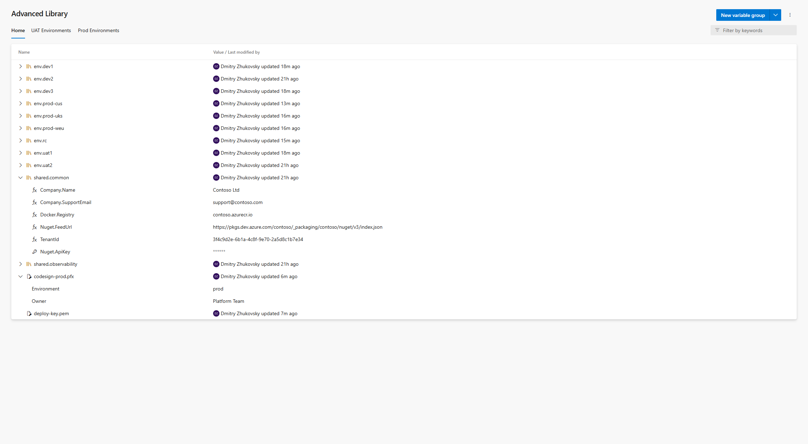
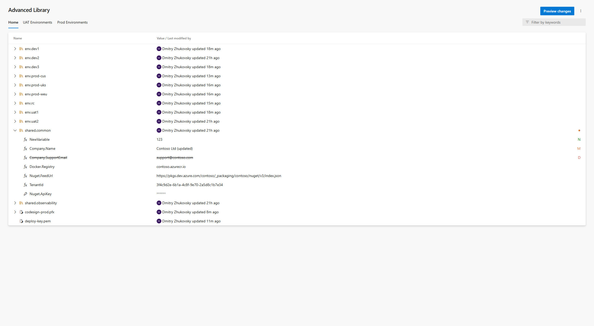
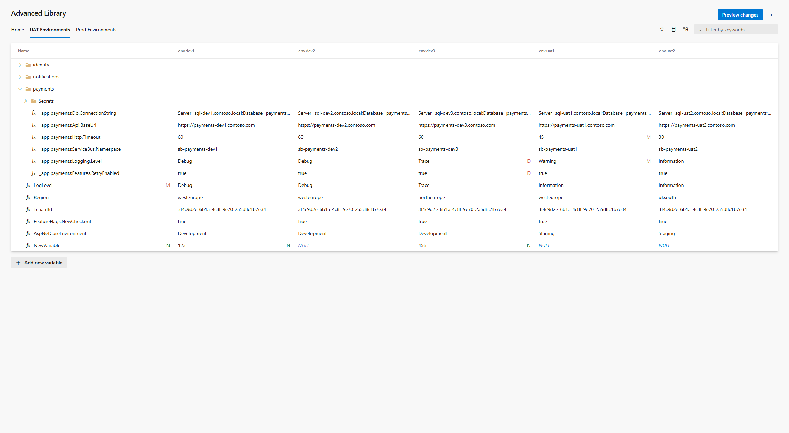
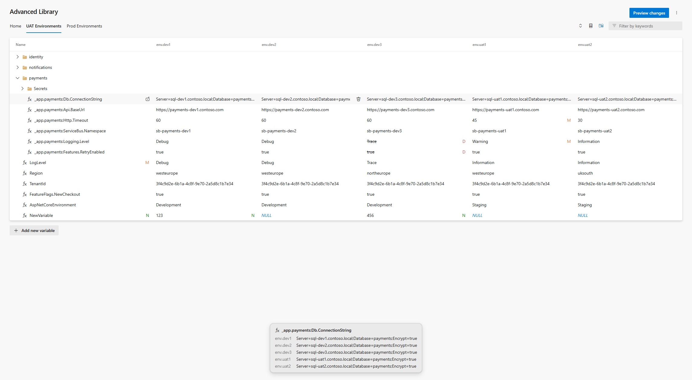
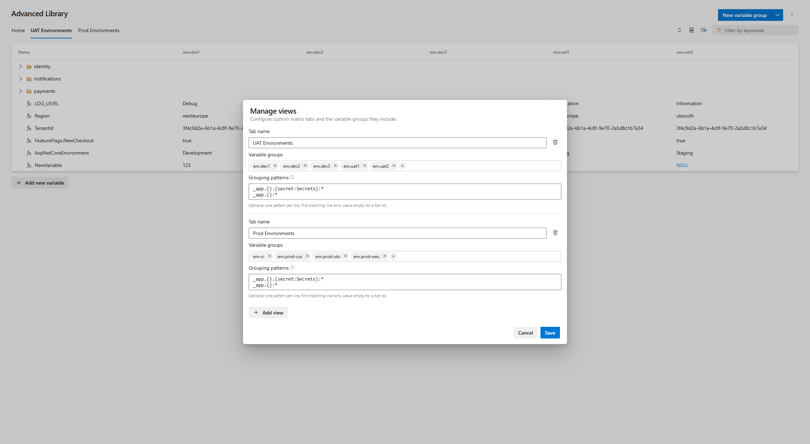
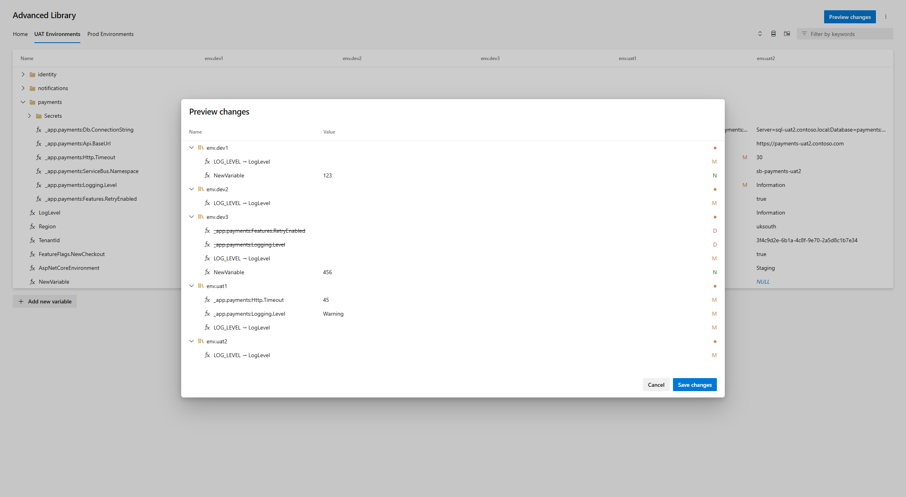
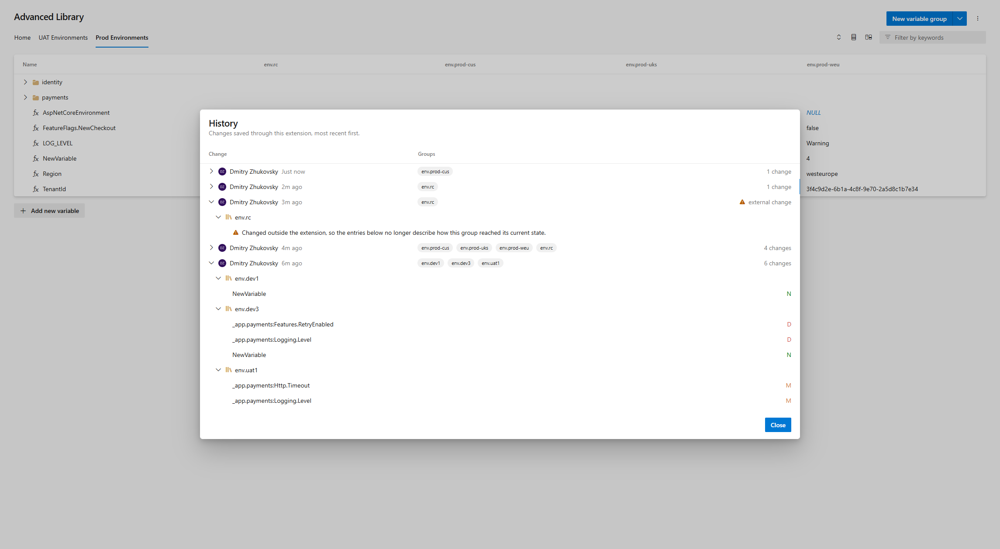

# Advanced Library

**Edit all your variable groups on one screen.** Advanced Library adds a power-user hub to Azure Pipelines: inline spreadsheet-style editing across variable groups, side-by-side matrix views for comparing environments, a change preview before anything is saved, and a per-project history of who changed what.

## Why

The built-in Library hub edits one variable group at a time, saves every change immediately, and keeps no meaningful change log. That gets painful the moment you manage the same set of variables across Dev / Test / Prod groups. Advanced Library shows everything at once, stages your edits locally, and lets you review the full change set before a single value is written.

## Features

### Inline editing

Edit variable names and values directly in the grid — no per-group drill-down, no modal per variable.

- Add, rename, delete and restore variables; toggle between plain text and secret.
- Every edit is staged locally and marked with a state indicator (**N**ew / **M**odified / **D**eleted) until you save or discard.
- Deleted variables stay visible (struck through) and can be restored with one click.
- Validation catches empty and duplicate names — errors are shown right inside the cell.
- Keyword search filters groups and variables by name and value.

### Matrix views

Build custom tabs that show a variable-by-group matrix: one row per variable name, one column per variable group. Perfect for keeping environment groups in sync.

- Instantly spot variables that are missing in one environment (`NULL` cells) and add them in place.
- Rename a variable across every group in the view at once.
- Organize hundreds of variables into folders with flexible grouping patterns (wildcards and captures).
- Toggle the **row comparison** panel to see one variable's value in every group, side by side.

Matrix tabs are yours to define: pick the groups a tab covers and how variable names collapse into folders.

### Preview changes before saving

Nothing is written until you say so. The **Preview changes** dialog shows the complete staged change set — added, modified, deleted and renamed items per group — with validation errors highlighted.

- Saving is per group and conflict-aware: if someone modified a group outside your session, that group is skipped with a clear error while the rest of your changes still save.
- Secrets stay masked everywhere; untouched values (including secrets) are preserved exactly as they are on the server.

### Change history

Every save made through the extension is recorded per project: who saved, when, which groups, and which variables were added, modified, renamed or deleted. Variable **values are never stored** — only names and change types.

- Changes made outside the extension (native UI, REST API, other tools) show up as explicit *external change* markers, so the timeline never silently lies to you.

### Export

Download any variable group as **JSON** or **YAML** from its context menu. Dot-separated variable names (`app.logging.level`) are expanded into nested objects, and values are typed (numbers, booleans). Note: secret values are not included — Azure DevOps never returns them.

### Secure files

Secure files and their properties are listed alongside variable groups, read-only, so the Home tab gives a complete picture of your project's library.

## Getting started

1. Install the extension in your organization.
2. Open **Pipelines → Advanced Library** in any project.

## Data, privacy and permissions

- The extension talks only to Azure DevOps REST APIs — no external services, no telemetry.
- Matrix view definitions and the change history are stored in the Azure DevOps extension data service, inside your own organization, scoped per project. Variable values are never written there.
- Requested scopes:
  - `vso.variablegroups_manage` — read and update variable groups (the only write operation the extension performs).
  - `vso.securefiles_read` — list secure files and their properties.

## Feedback and support

Found a bug or have an idea? Open an issue on [GitHub](https://github.com/dzhukovsky/azdo-advanced-library/issues). The extension is open source under the MIT license.
